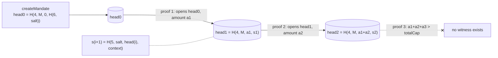

# zkmandate

**An AI agent proves each payment fits its spending mandate, without revealing the mandate.**

The principal sets a per-tx cap, a cumulative cap, a payee allowlist (up to 256 payees)
and an expiry. Only a Poseidon2 commitment to those terms goes on-chain. Escrowed tokens
move only when the agent supplies a Noir/UltraHonk proof that the payment fits the hidden
terms. For teams that run agents with budgets they don't want competitors reading.

> **Not audited. Testnet and local use only.** Built on Noir `1.0.0-beta.19` and a
> Barretenberg `4.0.0` nightly, with a generated Solidity verifier. Read
> [SECURITY.md](SECURITY.md) before trusting it with anything.

```
$ cd sdk && npm run demo

zkmandate: private spending mandates for AI agents

principal (private): max $5/tx, $12 total, 7 days, 3 vendors
on-chain   (public):  mandate 0x0cf297cb..270819  head 0x0dcf3e6b..b1af6d  escrow $50
                      caps, expiry and vendor list: not on-chain

payment 1  $4     -> weather-api  PAID proof 7872B in 279ms, verified on-chain, gas 2,504,398, weather-api balance $4
payment 2  $4     -> gpu-rental   PAID proof 7872B in 232ms, verified on-chain, gas 2,504,314, gpu-rental balance $4
payment 3  $3     -> search-api   PAID proof 7872B in 224ms, verified on-chain, gas 2,504,302, search-api balance $3
payment 4  $2     -> weather-api  NO PROOF (OVER_CUMULATIVE) the circuit is unsatisfiable, nothing to submit

what the chain knows
  mandate 0x0cf297cb..270819, head 0x20dee51f..159f4d, principal escrow $39
  3 payments: weather-api, gpu-rental, search-api (payee + amount are public token transfers)
what it does not know
  the per-tx cap, the total cap, the expiry, the other vendors on the allowlist, how many there are

the agent followed the rules. nobody had to see the rules.

bonus: unknown vendor -> NO PROOF (PAYEE_NOT_ALLOWED)
```

(Captured 2026-10-04 on a local anvil chain, Wasm prover, Apple M4. ANSI colors removed.)

The 4th payment is under the per-tx cap but over the remaining budget, so no proof
exists: there is nothing to submit, nothing to front-run, and nothing a jailbroken model
can talk its way around.

## Why

Spend limits for agents belong at settlement, not in the prompt. A contract that
enforces caps does that, but a public mandate also publishes the agent's budget, runway
and vendor list to anyone reading the chain. [Capline](https://github.com/agnij-dutta/capline),
the public sibling of this project, stores `maxPerTx`, `maxCumulative`, `expiry` and the
allowlist root in plain storage. zkmandate keeps the same rules and the same enforcement
point and hides the terms.

## Numbers

6,730 UltraHonk gates · 7,872-byte proof · about 0.1 s native / 0.3 s pure WASM to prove
on an Apple M4 · 28 MB peak RAM · about 2.45M gas to verify on-chain. Method, machine and
raw output in [BENCHMARKS.md](BENCHMARKS.md).

## Quickstart

Requirements: `nargo 1.0.0-beta.19` (`noirup -v 1.0.0-beta.19`), `bb 4.0.0-nightly.20260120`
(`bbup -v 4.0.0-nightly.20260120`), Foundry, Node 22. The nargo and bb versions must match
the `@noir-lang/noir_js` and `@aztec/bb.js` versions pinned in `sdk/package.json`.

```bash
git clone https://github.com/agnij-dutta/zkmandate
cd zkmandate
git submodule update --init      # forge-std
(cd sdk && npm ci)
./scripts/build.sh               # compile circuit, write vk, generate Solidity verifier, forge build
./scripts/test-all.sh            # nargo test + forge test + SDK typecheck and tests
(cd sdk && npm run demo)         # anvil + deploy + 3 private payments + a 4th that cannot be proven
```

`BACKEND=native npm run demo` proves with the native bb binary through bb.js (about 2x
faster than Wasm).

## Usage

### SDK (`sdk/`, package `zkmandate`)

```ts
import { createMandate, initialState, proveMandatePayment, payArgs, MandateViolation, toHex32 } from "zkmandate";

// Principal: write the mandate. Only the commitment and the initial head go on-chain.
const mandate = await createMandate({
  maxPerTx: 5_000_000n, totalCap: 12_000_000n,          // token base units (USDC: 6 decimals)
  notAfter: BigInt(Math.floor(Date.now() / 1000) + 7 * 86400),
  payees: [WEATHER_API, GPU_RENTAL, SEARCH_API],
});
let state = initialState(mandate);
await registry.write.createMandate([toHex32(mandate.commitment), toHex32(state.head), agentAddress]);
// Hand `mandate` (it contains the salt) to the agent over a private channel.

// Agent: prove, pay, advance.
const domain = { chainId, registry: registryAddress, principal: principalAddress };
try {
  const p = await proveMandatePayment(mandate, state, { amount: 4_000_000n, payee: WEATHER_API, validUntil, domain });
  await registry.write.pay(payArgs(p));
  state = p.newState;
} catch (e) {
  if (e instanceof MandateViolation) console.log("refused:", e.reason);
}
```

| export | what it does |
|---|---|
| `createMandate(terms)` | Builds the allowlist tree and the commitment. `terms`: `maxPerTx`, `totalCap`, `notAfter` (u64), `payees` (1 to 256 addresses), optional `salt` (must be >= 2^128; omit it to get 248 CSPRNG bits). |
| `initialState(mandate)` | State with `spent = 0`; its `head` is what `createMandate` stores. |
| `nextState(mandate, state, payment)` | Successor state without proving (bookkeeping, recovery). |
| `contextFor(domain, commitment)` | Mirrors `PrivateMandateRegistry.contextOf(principal, commitment)`. |
| `ZkMandateProver.create({ backend?, threads? })` | Long-lived prover. `backend`: `BackendType.Wasm` (default, in-process) or `BackendType.NativeUnixSocket` (native bb). |
| `prover.prove(mandate, state, payment)` | Returns `PaymentProof`: `proof`, `proofHex`, `publicInputs` (7, circuit order), `newState`, `args`, `timings`. Throws `MandateViolation` if no proof can exist. |
| `prover.verify(proof)` / `prover.destroy()` | Off-chain verification (same ZK/keccak settings as the Solidity verifier); release the backend. |
| `proveMandatePayment(...)` / `shutdown()` | Same as `prove` with a shared lazily created Wasm prover, and its cleanup. |
| `payArgs(proof)` | `pay()` arguments in ABI order. |
| `MandateViolation.reason` | `OVER_PER_TX`, `OVER_CUMULATIVE`, `EXPIRED`, `PAYEE_NOT_ALLOWED`, `ZERO_AMOUNT`, `BAD_STATE`, `UNKNOWN`. |
| `Allowlist`, `DEPTH`, `MAX_PAYEES`, hashing helpers, `TAG`, `FIELD_MODULUS`, `MIN_SALT`, `U64_MAX` | Lower-level building blocks; they match the circuit bit for bit. |

`Payment` is `{ amount, payee, validUntil, domain }`. Pick a short `validUntil` (say now
plus 10 minutes): it leaks only that the mandate does not expire before then.

### Contract (`PrivateMandateRegistry.sol`)

| function | who | what |
|---|---|---|
| `deposit(amount)` / `withdraw(amount)` | principal | Pooled escrow per principal. `deposit` credits the amount actually received. |
| `createMandate(commitment, initialHead, agent)` | principal | Registers a mandate under `mandateId(msg.sender, commitment)`. |
| `revoke(commitment)` | principal | Permanently disables it. A revoked commitment cannot be re-registered. |
| `pay(principal, commitment, payee, amount, validUntil, newHead, proof)` | agent | Checks agent, expiry and canonical inputs, verifies the proof against the stored head, advances the head, transfers. |
| `mandateId(principal, commitment)`, `contextOf(principal, commitment)`, `mandates(id)`, `escrowOf(principal)` | anyone | Views. |

### Scripts and environment

| command | what |
|---|---|
| `./scripts/build.sh` | `nargo compile`, `bb write_vk`, `bb write_solidity_verifier`, copy the stripped artifact to `sdk/circuit/`, `forge build` |
| `./scripts/test-all.sh` | `nargo test`, `forge test`, SDK typecheck and tests |
| `./scripts/bench-native.sh` | times the native bb CLI (run `npm run bench` first; it writes `circuits/Prover.toml`) |
| `sdk: npm run demo / fixtures / bench / lint / format / build` | demo, regenerate forge proof fixtures, benchmarks, ESLint + Prettier, compile to `dist/` |

| env var | default | used by |
|---|---|---|
| `NARGO` | `~/.nargo/bin/nargo` | `scripts/*.sh` |
| `BB` | `~/.bb/bb` | `scripts/*.sh` |
| `RUNS` | `10` | `npm run bench`, `bench-native.sh` |
| `BACKEND` | Wasm | `npm run demo` (`native` for the native bb backend) |

No secrets are needed. The demo uses anvil's public dev keys.

## How it works

### The statement

Public inputs, in this order: `mandate`, `old_state`, `new_state`, `amount`, `payee`,
`valid_until`, `context`. Private: `max_per_tx`, `total_cap`, `not_after`,
`allowlist_root`, `salt`, `spent`, `state_salt`, `payee_index`, `payee_path[8]`.

The circuit (`circuits/src/main.nr`) proves:

1. `mandate == H(1, maxPerTx, totalCap, notAfter, allowlistRoot, salt)`
2. `old_state == H(4, mandate, spent, stateSalt)`
3. `0 < amount <= maxPerTx`
4. `spent + amount <= totalCap`, computed in u128 so it cannot wrap
5. `valid_until <= notAfter`
6. `H(2, payee)` is a leaf of the depth-8 Merkle tree with root `allowlistRoot`, at an index below 256
7. `new_state == H(4, mandate, spent + amount, H(5, salt, old_state, context))`

`H` is Poseidon2 over BN254, with a distinct domain tag per role so no preimage can be
read as another kind of value. Every integer input is range checked in the constraint
system (u64 amounts and times, u32 index).

### The state chain: cumulative caps without a public counter



The registry stores one `head` per mandate. Each proof opens the current head privately
and commits to the successor with `spent + amount`. The registry accepts a proof only if
its `old_state` equals the stored head, then moves the head forward. So:

* **Replays fail for free.** A replayed proof refers to a stale head. No nullifier set,
  one 32-byte slot per mandate.
* **No forks, no under-reporting.** The next salt is derived in-circuit, so a head has
  exactly one successor per amount, and the new head must commit to `spent + amount`.
* **Recoverable state.** Salts are derived, so an agent that loses local state rebuilds
  it from the mandate secret and the public `Paid` events.
* **Sequential per mandate.** An agent can pre-compute proof N+1 against the expected head
  before N lands; if N fails, N+1 is void.

### Expiry with `valid_until`

The prover cannot know the timestamp of the block that will include its transaction. So
the proof states `valid_until <= notAfter` and the contract checks
`block.timestamp <= valid_until`. Together: payment time `<= notAfter`, exactly.

### Domain binding

`context = keccak256(chainid, registry, principal, commitment) >> 8` is computed by the
contract and folded into the next salt in-circuit. A proof for one chain, registry or
principal is useless anywhere else. Mandates are stored under
`keccak256(principal, commitment)`, so copying someone's commitment cannot block them.

### Why the payee is public

On a transparent EVM the escrow has to `transfer(payee, amount)`, so the payee is visible
anyway. Making it a public input also binds the proof to the recipient: a relayer or
front-runner cannot redirect a valid proof. What stays hidden is the allowlist: the other
vendors and how many there are (the tree is always depth 8, zero padded).

## Security model and limitations

**Hidden from everyone except the principal and the agent:** `maxPerTx`, `totalCap`,
`notAfter`, the allowlist members not yet paid and its size, and so the remaining budget.

**Public:**

* Each payment's payee and amount (they are token transfers). Therefore `spent` is the
  sum of a mandate's `Paid` events. The state chain enforces the cap; it hides `spent`
  only once amounts are shielded too.
* Lower bounds: the largest payment bounds `maxPerTx`, total paid bounds `totalCap`, each
  `validUntil` bounds `notAfter`, every paid vendor is an allowlist member.
* Principal and agent addresses, the commitment, the pooled escrow balance, revocation.

**Trust assumptions:**

* **The salt is the secret.** Caps are low entropy, so the commitment hides them only
  because of the salt. The SDK draws 248 random bits and rejects caller salts below 2^128.
  The principal and the agent both hold it; a leak reveals the terms (but cannot spend:
  only the agent address can call `pay`).
* **The principal is trusted for liveness, not for the agent's limits.** It computes the
  initial head (a wrong one bricks only its own mandate), can withdraw escrow at any time,
  and payees are trusting it until a payment lands.
* **Revocation can be raced** by an agent that sees it in the mempool.
* **One budget per registration.** The same commitment registered on two registries or
  chains gets its full cap on each. Use a fresh salt per registration.
* **ZK flavor only** (`-t evm`). UltraHonk uses KZG with the Aztec Ignition SRS
  (universal setup, no per-circuit ceremony).
* **Toolchain:** pre-release Noir and bb, generated verifier, `noir-lang/poseidon v0.2.6`
  used only through fixed-length `Poseidon2::hash` (the v0.4.0 streaming-hasher fix does
  not apply). Hashes are cross-checked between Noir and bb.js in the SDK tests.

The full review notes, the fixed findings and how to report a vulnerability are in
[SECURITY.md](SECURITY.md).

## Prior art

* [Capline](https://github.com/agnij-dutta/capline): the public version of the same
  mandate (x402 + ERC-8004). zkmandate replaces its public fields with a commitment and a
  state chain.
* [Zcash](https://z.cash/) and [Aztec](https://aztec.network/) note commitments: hiding
  state as a chain of commitments that a proof consumes and produces.
* [Semaphore](https://github.com/semaphore-protocol/semaphore): Poseidon Merkle
  membership proofs. Here membership is for payees, and the tree is fixed size so its
  population stays hidden.
* [AP2](https://github.com/google-agentic-commerce/AP2) intent mandates and
  [x402](https://github.com/coinbase/x402): agent payment authorization and settlement.
  zkmandate is an enforcement layer such mandates could settle through.

What this adds: cumulative caps over private terms with constant on-chain storage per
mandate, and a working EVM path (Noir circuit, generated UltraHonk verifier, escrow,
TS prover) with real gas and proving numbers.

## Roadmap

* Shielded settlement (a private-transfer token or pool), so amounts and payees are hidden
  and the state chain hides `spent` too.
* Recursive aggregation of N payments into one proof to amortize the ~2.4M gas verify.
* Bind the mandate to an AP2 intent mandate hash and an ERC-8004 agent identity instead
  of a raw agent address; principal signature over the commitment for third parties.
* Agent rotation without re-creating the mandate.
* x402 integration (`withZkMandate(...).pay(requirements)`), mirroring Capline's `withCapline`.
* Solana: Barretenberg has no Solana target. The realistic path is a Groth16 port verified
  with the `alt_bn128` syscalls (about 200k CU, 256-byte proof, per-circuit setup). An
  off-chain verifier with on-chain attestation is cheaper to build but adds trust; a
  native UltraHonk verifier program would likely exceed the per-transaction compute budget.
* An audit, and stable Noir and bb releases.

## Contributing

See [CONTRIBUTING.md](CONTRIBUTING.md). Security issues: [SECURITY.md](SECURITY.md).

## License

[MIT](LICENSE) © 2026 Agnij Dutta

## Author

Agnij Dutta ([@0xholmesdev](https://x.com/0xholmesdev))
